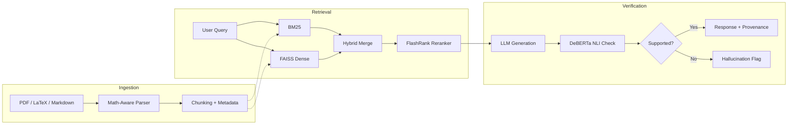

# Sharansh Pandey

 

 

---

 

## About

**B.Tech AI & Data Science · GGSIPU · 2027**

I built a [leakage-free credit risk platform](https://github.com/sharansh-22/Credit-Risk) on 1.34M loans, a [hallucination-audited RAG system](https://github.com/sharansh-22/Research-OS) for ML research, and a [quantitative research program](https://github.com/sharansh-22/CRIS) that documented negative results instead of hiding them. I care more about reproducibility, leakage-free evaluation, and explainability than benchmark scores.

 

---

 

## Featured Projects

 

<table>
<tr>
<td width="50%" valign="top">

### [Research-OS](https://github.com/sharansh-22/Research-OS)
**Research-Oriented RAG System for ML Research**

A retrieval-augmented generation system with hallucination auditing, research provenance, and math-aware document ingestion.

| Component | Detail |
|:--|:--|
| Retrieval | FAISS + BM25 hybrid |
| Reranking | FlashRank |
| Verification | DeBERTa NLI |
| Auditing | Chain-of-Thought + Hallucination detection |
| Ingestion | Math-aware document pipeline |
| Stack | React · FastAPI |

<!-- METRICS: Replace these with your real numbers -->
<!-- | Papers indexed | 500+ | -->
<!-- | Hallucination detection rate | XX% | -->
<!-- | Avg. retrieval latency | XXms | -->

</td>
<td width="50%" valign="top">

### [Credit Risk Platform](https://github.com/sharansh-22/Credit-Risk)
**Leakage-Free Consumer Credit Risk Modelling**

A rigorous credit risk platform with systematic leakage auditing, out-of-time validation, and economic impact simulation.

| Component | Detail |
|:--|:--|
| Dataset | 1.34M LendingClub loans |
| Modelling | LightGBM · Borrower-only features |
| Explainability | SHAP · Risk segmentation |
| Validation | Out-of-time · Leakage audit |
| Analysis | Stealth defaulter profiling |
| Output | Interactive dashboards · Economic sim |

<!-- METRICS: Replace these with your real numbers -->
<!-- | AUC-ROC | 0.XX | -->
<!-- | Features removed (leakage) | XX | -->
<!-- | Default rate captured (top decile) | XX% | -->

</td>
</tr>
</table>

 

<!-- 
  TODO: Add a screenshot of the Credit Risk dashboard here.
  Save the image to your repo and uncomment the line below.
  
  

  
  

-->

 

### [CRIS — Cascade Risk Intelligence System](https://github.com/sharansh-22/CRIS)
**Does Environmental Intelligence Improve Financial Decision Systems?**

> A quantitative research program investigating whether macroeconomic and market signals improve default prediction beyond borrower-centric models. Negative findings were documented and published rather than discarded.

<table>
<tr>
<td width="50%" valign="top">

#### Research Design
- Controlled comparison: borrower-only vs. macro-augmented models
- Systematic correlation analysis of macroeconomic features
- Cascade architecture for staged signal integration

</td>
<td width="50%" valign="top">

#### Key Findings
- **Borrower-centric models outperformed** direct macro integration
- Macroeconomic signals exhibited strong correlation but **limited incremental predictive value**
- Negative results documented — future directions derived from evidence

</td>
</tr>
</table>

<!-- 
  TODO: Add specific metric comparison. Example:
  
  | Model | AUC-ROC | Gini |
  |:--|:--|:--|
  | Borrower-only | 0.XX | 0.XX |
  | Macro-augmented | 0.XX | 0.XX |
  | Cascade | 0.XX | 0.XX |
-->

 

<b>Research-OS Architecture</b>

 

 

---

 

## Tech Stack

**Risk & ML** &nbsp;&nbsp;

**Data** &nbsp;&nbsp;

**Systems** &nbsp;&nbsp;

**Also** &nbsp;&nbsp;

 

---

 

## Research Interests & Direction

| Domain | Focus | Evidence |
|:--|:--|:--|
| **Credit Risk** | Temporal dynamics, regime-aware default models, PD/LGD/EAD | Credit Risk Platform, CRIS |
| **Financial ML** | Feature leakage, out-of-time validation, model interpretability | Credit Risk Platform |
| **Quantitative Research** | Hypothesis-driven experimentation, negative result documentation | CRIS |
| **Research Infrastructure** | Retrieval architectures, hallucination auditing, provenance | Research-OS |

 

---

 

## Next Research Directions

| Question | Domain |
|:--|:--|
| How do credit risk models degrade across economic regimes? | Stochastic processes · Regime detection |
| Can Basel PD/LGD/EAD models be improved with ML while maintaining regulatory interpretability? | Advanced credit risk · Regulatory ML |
| What is the calibration gap between probabilistic ML models and observed default rates? | Bayesian methods · Uncertainty quantification |
| How does order flow asymmetry predict short-term credit spread movements? | Market microstructure · Fixed income |

 

---

 

## GitHub Statistics

 

---

 

Open to research collaborations in quantitative finance and financial ML.

&nbsp;&nbsp;

